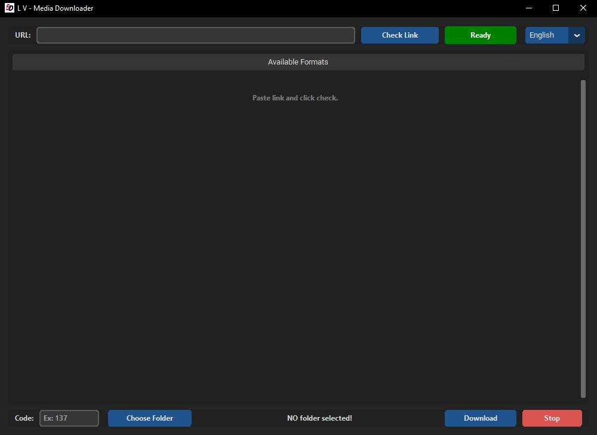

# L V Media Downloader

- 🇧🇷 [Leia em Português](README.pt.md)  
- 🇪🇸 [Leia em Espanhol](README.es.md)

# 🎬 L V Media Downloader (GUI para yt-dlp)

Una interfaz gráfica moderna, robusta y eficiente para descargar vídeos y transmisiones en directo utilizando `yt-dlp`. 
Ideal para aquellos que quieren evitar el uso del terminal y automatizar las descargas con una interfaz de usuario profesional y receptiva.

---

## 🚀 Objetivo

> «Solía descargar transmisiones en directo y vídeos y siempre tenía que abrir el terminal, escribir comandos y lidiar con los errores manualmente. Este programa se creó para simplificar ese proceso, pasando de la dificultad de la línea de comandos a una experiencia visual fluida con un solo clic».

---

## 🖥️ Características

### Nueva interfaz interactiva
- Lista de formatos inteligente: se acabó adivinar o escribir códigos manualmente.
- 🟦 Botón azul (Seleccionar): selecciona instantáneamente el ID de vídeo/audio.
- 🟩 Botón verde (+): añade de forma inteligente el audio al vídeo (por ejemplo, crea automáticamente 137+140).
- Diseño responsivo: utiliza un sistema de cuadrícula inteligente que se adapta a los ID largos (perfecto para transmisiones de Instagram/TikTok/DASH).
- Sistema de doble panel: cambia automáticamente entre la lista de selección y el registro de descargas para garantizar el máximo rendimiento sin que se cuelgue la interfaz de usuario.
- 🎨 Interfaz moderna que utiliza `CustomTkinter`

### Funcionalidad principal
- Multihilo: la interfaz de usuario nunca se cuelga mientras se verifican los enlaces o se descargan archivos.
- Menú contextual Pro: haz clic con el botón derecho en cualquier campo de texto para cortar, copiar, pegar, eliminar o seleccionar todo.
- Parada inteligente: distingue entre una parada manual por parte del usuario (Info) y errores reales o finales naturales de la transmisión (Success).
- Análisis limpio: filtra automáticamente el ruido (como las líneas separadoras) de la salida de yt-dlp.
- Marcas de tiempo: los nombres de los archivos incluyen marcas de tiempo para evitar sobrescribir archivos.

---

## 📦 Requisitos

### ✔️ Dependencias de Python

Instala los siguientes paquetes con `pip`:

```bash
pip install customtkinter
```

> El tkinter estándar viene preinstalado con Python en Windows.
> Si utilizas Linux, puedes instalarlo con: 
```bash
sudo apt install python3-tk
```

### ✔️ yt-dlp (el motor de descarga)

Necesitas tener yt-dlp instalado y accesible desde el terminal (CMD):

```bash 
pip install yt-dlp 
```
De esta manera, yt-dlp estará disponible en tu entorno Python y el script podrá llamarlo directamente sin necesidad de descargas manuales ni configuración de PATH.

### ✔️ FFmpeg (necesario para la fusión)
Para utilizar el botón verde «+» (fusión de vídeo + audio), FFmpeg debe estar instalado en tu sistema. Sin él, yt-dlp no puede fusionar flujos separados.


---

## 📁 Estructura

```
lvkMD/
├── media/
│   └── 5D.ico       # Icono de la aplicación
├── main.py          # Código fuente
└── .gitignore

```

---

## ▶️ Cómo utilizarlo

1. Ejecute la aplicación: ``python main.py`` (o ejecute el archivo compilado ``.exe``)
2. Seleccione el idioma: utilice el menú desplegable (arriba a la derecha) para elegir su idioma preferido.
3. Pegue la URL: compatible con YouTube, Twitch, Instagram, Kick, etc. (Consejo: haz clic con el botón derecho para pegar).
4. Haz clic en «Comprobar enlace»: la aplicación mostrará todos los formatos disponibles en una cuadrícula interactiva.
5. Selecciona los formatos: 
  - Haz clic en el ID (🟦) para seleccionar la pista de vídeo. 
  - Haz clic en el + (🟩) de una pista de audio para combinarlas.
6. Elige la carpeta: selecciona dónde guardar el archivo.
7. Haz clic en «Descargar»: la pantalla cambiará a la vista de registro, que muestra el progreso en tiempo real.
8. Control: puedes detener la descarga en cualquier momento. La aplicación te notificará si se ha detenido manualmente o si se ha completado con éxito.

---

## 📸 Interfaz

> 

---

## 🔄 Historial de versiones


### ✅ Versión 3.0 (actualización importante)
- Compatibilidad con varios idiomas (EN, PT, ES).
- Arquitectura: reescritura completa a OOP (programación orientada a objetos).
- Rendimiento: se ha implementado el subprocesamiento para evitar problemas de «la aplicación no responde».
- UI/UX:
  - Sustitución de la lista basada en texto por botones interactivos.
  - Adición de diseño en cuadrícula para una mejor alineación de ID complejos.
  - Adición de menú contextual (funciones con el botón derecho del ratón).

###  Versión 2.0
- Compatibilidad con la descarga combinada de vídeo + audio (`137+140`)
- Mejora de la legibilidad de los formatos enumerados.
- Actualizaciones visuales y estructurales del código.

---

## 💡 Mejoras futuras

- Compatibilidad con múltiples descargas en cola.
- Historial de descargas.
- Detección automática del mejor formato.
- Interfaz de salida de texto mejorada para una mayor legibilidad.

---

## 🛠️ Tecnologías utilizadas

- Python 3.12+🐍
- [yt-dlp](https://github.com/yt-dlp/yt-dlp)
- [CustomTkinter](https://github.com/TomSchimansky/CustomTkinter)

---

## 📄 Licencia

- Este proyecto está licenciado bajo la licencia MIT.
- ¡Siéntete libre de modificarlo y contribuir!
---


Traducción realizada con la versión gratuita del traductor DeepL.com