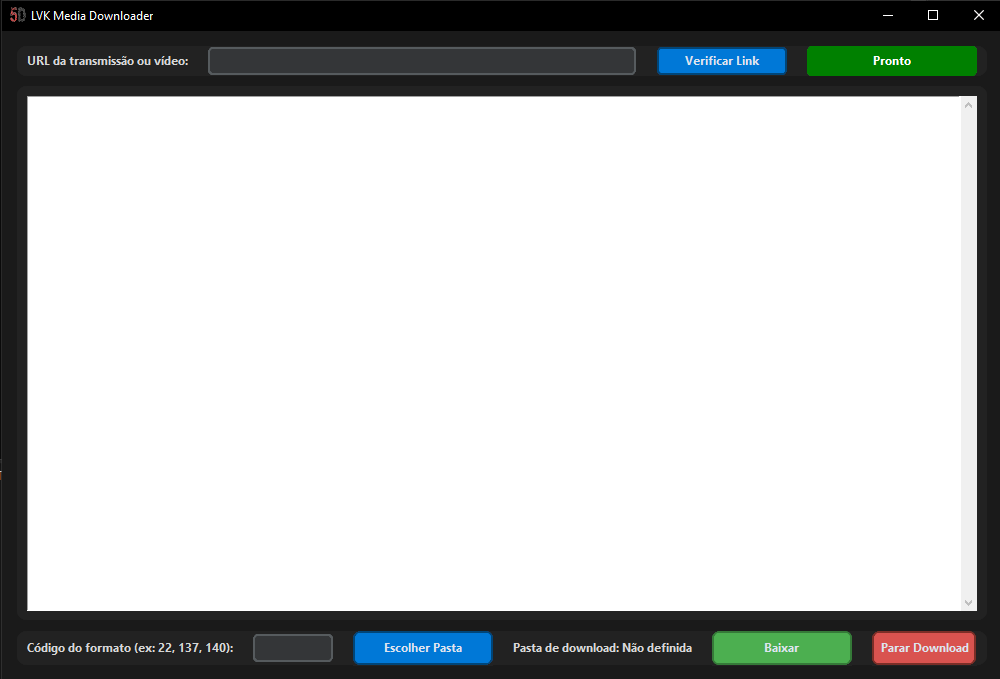

# 🎬 Gravador de Lives (GUI para yt-dlp)

Uma interface gráfica simples, moderna e eficiente para baixar vídeos e transmissões ao vivo usando `yt-dlp`.  
Ideal para quem quer evitar o uso do terminal e automatizar o processo de download com apenas alguns cliques.

---

## 🚀 Objetivo

> "Eu baixava lives e vídeos e sempre precisava abrir o terminal, digitar comandos e lidar com erros manualmente. Este programa foi criado para facilitar esse processo — com uma interface visual simples e funcional."

---

## 🖥️ Funcionalidades

- Verificar a qualidade/formatos disponíveis de vídeos via link.
- Escolher o código do formato desejado (áudio, vídeo, ambos).
- Selecionar uma pasta de destino personalizada para salvar os arquivos.
- Iniciar, acompanhar e parar o download em tempo real.
- Interface responsiva, com status do processo e saída ao vivo do `yt-dlp`.

---

## 📦 Requisitos

### ✔️ Dependências Python

Instale os seguintes pacotes com `pip`:

```bash
pip install customtkinter
```

> O `tkinter` padrão já vem com o Python em sistemas Windows.  
> Se estiver usando Linux, você pode instalar com:
> ```bash
> sudo apt install python3-tk
> ```

### ✔️ yt-dlp (o motor de download)

Você precisa ter o `yt-dlp` instalado e acessível pelo terminal (CMD):

1. [Baixe o yt-dlp aqui](https://github.com/yt-dlp/yt-dlp/releases/latest)
2. Renomeie o executável para `yt-dlp.exe`
3. Coloque-o em uma pasta e adicione essa pasta à variável de ambiente `PATH`, **ou** coloque `yt-dlp.exe` na mesma pasta do seu script.

---

## 📁 Estrutura

```
lvkMD/
├── media/
│   └── 5D.ico
└── main.py

```

---

## ▶️ Como usar

1. Execute o script Python:  
   `python main.py`
2. Cole o link de uma transmissão ou vídeo.
3. Clique em **Verificar Link** para listar os formatos disponíveis.
4. Escolha o código do formato (ex: 22, 137, 140).
5. Clique em **Escolher Pasta** e selecione onde quer salvar.
6. Clique em **Baixar** e acompanhe o progresso.
7. Pode clicar em **Parar Download** para cancelar o processo.

---

## 📌 Observações

- O programa funciona com qualquer link suportado pelo `yt-dlp`: YouTube, Twitch, Facebook, etc.
- O ícone pode ser trocado por qualquer `.ico` personalizado.
- O nome do arquivo salvo inclui um timestamp para evitar sobrescrever vídeos com o mesmo nome. 

---

## 📸 Interface

> 

---

## 💡 Futuras melhorias

- Suporte a múltiplos downloads em fila
- Histórico de vídeos baixados
- Detecção automática do melhor formato
- Conversão da tela do texto para melhor entendimento

---

## 🛠️ Feito com

- Python 🐍
- [yt-dlp](https://github.com/yt-dlp/yt-dlp)
- [CustomTkinter](https://github.com/TomSchimansky/CustomTkinter)

---

## 📄 Licença

Este projeto está sob a licença MIT.  
Sinta-se à vontade para modificar e contribuir!

---
